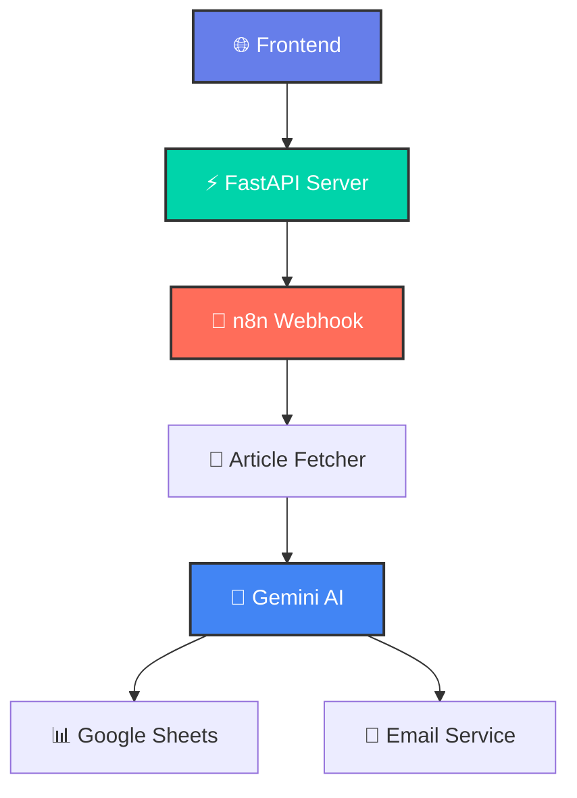

<div align="center">

# 🧠 Article Processor AI

[](https://fastapi.tiangolo.com/)
[](https://www.python.org/)
[](https://n8n.io/)
[](https://openai.com/)

**🚀 AI-Powered Article Analysis & Insights Platform**

*Transform any article into actionable insights with cutting-edge AI technology*

[🌐 Live Demo](#-live-demo) • [📖 Documentation](#-documentation) • [⚡ Quick Start](#-quick-start) • [🤝 Contributing](#-contributing)

</div>

---

## ✨ Features

<div align="center">

| 🎯 **Core Features** | 🛠️ **Technical Features** | 🎨 **UI/UX Features** |
|:---:|:---:|:---:|
| 🤖 **AI-Powered Analysis** | ⚡ **FastAPI Backend** | 🎨 **Modern Design** |
| 📝 **Article Summarization** | 🔗 **n8n Integration** | 📱 **Responsive Layout** |
| 💡 **Key Insights Extraction** | 🔐 **Session Management** | ✨ **Smooth Animations** |
| 📧 **Email Delivery** | 🛡️ **Input Validation** | 🎯 **User-Friendly** |
| 📊 **Data Storage** | 🔄 **Real-time Processing** | 🌈 **Beautiful Gradients** |

</div>

## 🎯 What You'll Get

<div align="center">

### 📋 **Article Summary**
AI-generated 3-5 sentence summary of any article

### 💡 **Key Insights** 
Extract 3-5 important insights and takeaways

### 📧 **Email Delivery**
Results delivered directly to your inbox

### 📊 **Data Storage**
Results saved for future reference

</div>

## 🚀 Quick Start

### Prerequisites

- Python 3.8+
- pip (Python package installer)

### Installation

1. **Clone the repository**
```bash
git clone https://github.com/yourusername/article-processor-ai.git
cd article-processor-ai
```

2. **Install dependencies**
```bash
pip install -r requirements.txt
```

3. **Start the application**
```bash
python main.py
```

4. **Open your browser**
```
http://localhost:8000
```

## 📖 Documentation

### API Endpoints

#### 🎯 **POST /chat**
Process article for AI analysis

**Request:**
```json
{
  "email": "user@example.com",
  "article_url": "https://example.com/article"
}
```

**Response:**
```json
{
  "success": true,
  "message": "Article processing started successfully",
  "session_id": "uuid-generated-session-id",
  "webhook_response": {
    "message": "Workflow was started"
  }
}
```

#### 🔍 **GET /**
Serve the main frontend interface

#### ❤️ **GET /health**
Health check endpoint

### Interactive Documentation

- **Swagger UI**: `http://localhost:8000/docs`
- **ReDoc**: `http://localhost:8000/redoc`

## 🏗️ Architecture



## 🛠️ Tech Stack

<div align="center">

| **Frontend** | **Backend** | **AI/ML** | **Automation** |
|:---:|:---:|:---:|:---:|
|  |  |  |  |
|  |  |  |  |
|  |  |  |  |

</div>

## 🌐 Live Demo

<div align="center">

### 🎨 **Beautiful Frontend Interface**


### 📱 **Responsive Design**


</div>

## 🔧 Configuration

### Environment Variables

Create a `.env` file in the root directory:

```env
# Webhook Configuration
WEBHOOK_URL=https://mahisalman.app.n8n.cloud/webhook/8f901235-6202-4a78-955d-89ecc3996308

# Server Configuration
HOST=0.0.0.0
PORT=8000
DEBUG=True
```

### Customization

- **Webhook URL**: Update the webhook URL in `main.py`
- **Styling**: Modify `static/style.css` for custom themes
- **API Endpoints**: Add new endpoints in `main.py`

## 📊 Project Structure

```
article-processor-ai/
├── 📁 static/
│   ├── 📄 index.html          # Main frontend page
│   ├── 🎨 style.css           # Modern CSS styling
│   └── ⚡ script.js           # Interactive JavaScript
├── 📄 main.py                 # FastAPI application
├── 📄 requirements.txt        # Python dependencies
├── 📄 README.md              # Project documentation
└── 📄 .env                   # Environment variables
```

## 🚀 Deployment

### Local Development

```bash
# Development mode with auto-reload
uvicorn main:app --reload --host 0.0.0.0 --port 8000
```

### Production Deployment

```bash
# Production mode
uvicorn main:app --host 0.0.0.0 --port 8000 --workers 4
```

### Docker Deployment

```dockerfile
FROM python:3.9-slim

WORKDIR /app
COPY requirements.txt .
RUN pip install -r requirements.txt

COPY . .
EXPOSE 8000

CMD ["uvicorn", "main:app", "--host", "0.0.0.0", "--port", "8000"]
```

## 🤝 Contributing

We welcome contributions! Please see our [Contributing Guidelines](CONTRIBUTING.md) for details.

### Development Setup

1. Fork the repository
2. Create a feature branch: `git checkout -b feature/amazing-feature`
3. Commit your changes: `git commit -m 'Add amazing feature'`
4. Push to the branch: `git push origin feature/amazing-feature`
5. Open a Pull Request

## 📝 License

This project is licensed under the MIT License - see the [LICENSE](LICENSE) file for details.

## 👨‍💻 Author

<div align="center">

**Mahi Salman**

[](https://linkedin.com/in/mahisalman)
[](https://github.com/mahisalman)
[](https://mahisalman.dev)

</div>

## 🙏 Acknowledgments

- [FastAPI](https://fastapi.tiangolo.com/) for the amazing web framework
- [n8n](https://n8n.io/) for workflow automation
- [Google AI](https://ai.google.dev/) for Gemini AI capabilities
- [Font Awesome](https://fontawesome.com/) for beautiful icons

---

<div align="center">

### ⭐ **Star this repository if you found it helpful!**

[](https://github.com/mahisalman/article-processor-ai)
[](https://github.com/mahisalman/article-processor-ai)

**Made with ❤️ by [Mahi Salman](https://linkedin.com/in/mahisalman)**

</div>
